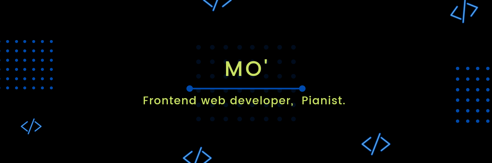

<h1 align="center">Hi I'm Mo</h1>
<h3 align="center">I'm a Software engineer with a passion for building solutions. I love designing visually appealing interfaces and ensuring that the end-user experience is seamless.</h3>

<p align="left">  </p>

<p align="left"> <a href="https://twitter.com/mo_renike_" target="blank"></a> </p>

[](https://holopin.io/@morenike)

``` js
const username = 'Mo';
const favFoods = 'Amala', 'pasta';
const pronouns = 'She/They';
let currentLocation = 'West Africa';

let status = 
{ 
  learning : [TYpescript, React, AI],
  interests: [Software Engineering, Artificial Intelligence, Digital Art],
  hobbies: [Coding, Online Window-Shopping, Dressing Up, Eating Junk, Googling(-_-), Playing Piano]
}

Developer dev = new Developer(Mo);

while(dev.isCoding() && dev.isStuck())  
{
  dev.openBrowser();
  dev.openChatGPT();
  dev.findSolution();
  dev.feelProfessional();
}
```

- 🔭 I’m currently working at Fluna

- 🌱 I have a  Software Engineering diploma from AltSchool Africa

👯 I'm looking to collaborate/work with individuals, companies, and agencies that aim to solve real-life problems with their awesome product or service ideas.

- 👨‍💻 Most of my projects are available at [My portfolio website](https://portfolio-mo-renike.vercel.app/) 
- 📝 I sometimes write articles on [hashnode](https://mo-inspired.hashnode.dev/)

- 💬 Ask me about ** My favorite Music **

- 📫 Send me a mail directly at **morenikeoyewole.o@gmail.com**


- ⚡ Fun fact **I play multiple musical instruments **
</br>
<h3 align="left">If You'd like to Connect with me:</h3>
<p align="left">
 <a href="https://twitter.com/mo_renike_" target="blank"></a>
<a href="https://codepen.io/morenike" target="blank"></a>
<a href="https://dev.to/morenike" target="blank"></a>
<a href="https://www.linkedin.com/in/morenike-oyewole/" target="blank"></a>
<a href="https://stackoverflow.com/users/morenike-oyewole" target="blank"></a>
<a href="https://instagram.com/herroyalpianist" target="blank"></a>
</p>
</br>
<h3 align="left">Languages and Tools I'm proficient in:</h3>
<p align="left"> <a href="https://getbootstrap.com" target="_blank">  </a> <a href="https://www.w3schools.com/css/" target="_blank">  </a> <a href="https://git-scm.com/" target="_blank">  </a> <a href="https://www.w3.org/html/" target="_blank">  </a> <a href="https://developer.mozilla.org/en-US/docs/Web/JavaScript" target="_blank">  </a> <a href="https://reactjs.org/" target="_blank">  </a>  </p>

</br>

<p></p>

<p>&nbsp;</p>

<p></p>
</br>
<h3 align="left">❤ Support me:</h3>
<p><a href="https://www.buymeacoffee.com/morenike"> </a></p><br><br>


